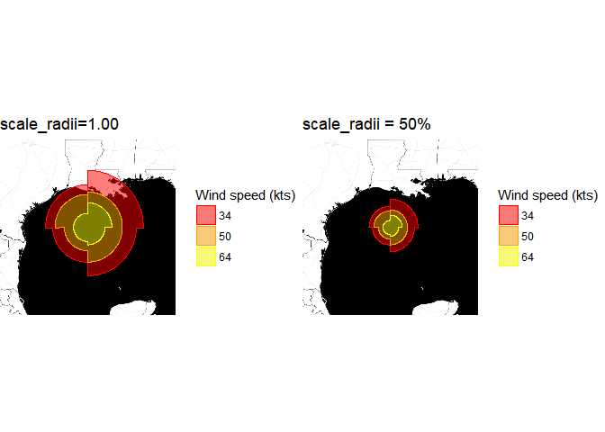

# GGPLOT2 GEOM
Yaakov Miller  
April 30, 2017  


## Runnig geom

For Hurricane Ike


```r
library(dplyr)
```

```
## 
## Attaching package: 'dplyr'
```

```
## The following objects are masked from 'package:stats':
## 
##     filter, lag
```

```
## The following objects are masked from 'package:base':
## 
##     intersect, setdiff, setequal, union
```

```r
library(ggmap)
```

```
## Warning: package 'ggmap' was built under R version 3.3.3
```

```
## Loading required package: ggplot2
```

```
## Warning: package 'ggplot2' was built under R version 3.3.3
```

```r
library(buildnewgeomwk4)
library(gridExtra)
```

```
## Warning: package 'gridExtra' was built under R version 3.3.3
```

```
## 
## Attaching package: 'gridExtra'
```

```
## The following object is masked from 'package:dplyr':
## 
##     combine
```

```r
library(lubridate)
```

```
## 
## Attaching package: 'lubridate'
```

```
## The following object is masked from 'package:base':
## 
##     date
```

```r
ext_tracks<-read_ext_tracks(file="ebtrk_atlc_1988_2015.txt")
```

```
## Parsed with column specification:
## cols(
##   .default = col_integer(),
##   storm_id = col_character(),
##   storm_name = col_character(),
##   month = col_character(),
##   day = col_character(),
##   hour = col_character(),
##   latitude = col_double(),
##   longitude = col_double(),
##   storm_type = col_character(),
##   final = col_character()
## )
```

```
## See spec(...) for full column specifications.
```

```r
tidy_ext_tracks<-tidy_tracks(ext_tracks=ext_tracks)

h_name <- "IKE"
h_time <- lubridate::ymd_h("2008 09 12 12")


storm_observation<-filter_(tidy_ext_tracks,
                                  ~storm_name %in% h_name,
                                  ~date %in% h_time)
```

```
## Warning: package 'bindrcpp' was built under R version 3.3.3
```

```r
loc<-unique(c(storm_observation$longitude,storm_observation$latitude))

Normal<-get_map(location=loc,
           zoom =6 , maptype = "toner-background") %>%
        ggmap(extent = "device")+geom_hurricane(data=storm_observation,
                                                mapping=aes(x=longitude,y=latitude,
                                                            r=wind_radius,
                                                            wind_speed=wind_speed,
                                                            quadrant=quadrant,
                                                            fill=as.factor(wind_speed),
                                                            color=as.factor(wind_speed)))+
        scale_color_manual(name = "Wind speed (kts)", 
                           values = c("red", "orange", "yellow")) + 
        scale_fill_manual(name = "Wind speed (kts)", 
                          values = c("red", "orange", "yellow"))+
        ggtitle("scale_radii=1.00")
```

```
## maptype = "toner-background" is only available with source = "stamen".
```

```
## resetting to source = "stamen"...
```

```
## Map from URL : http://maps.googleapis.com/maps/api/staticmap?center=26.9,-92.2&zoom=6&size=640x640&scale=2&maptype=terrain&sensor=false
```

```
## Map from URL : http://tile.stamen.com/toner-background/6/14/25.png
```

```
## Map from URL : http://tile.stamen.com/toner-background/6/15/25.png
```

```
## Map from URL : http://tile.stamen.com/toner-background/6/16/25.png
```

```
## Map from URL : http://tile.stamen.com/toner-background/6/14/26.png
```

```
## Map from URL : http://tile.stamen.com/toner-background/6/15/26.png
```

```
## Map from URL : http://tile.stamen.com/toner-background/6/16/26.png
```

```
## Map from URL : http://tile.stamen.com/toner-background/6/14/27.png
```

```
## Map from URL : http://tile.stamen.com/toner-background/6/15/27.png
```

```
## Map from URL : http://tile.stamen.com/toner-background/6/16/27.png
```

```
## Map from URL : http://tile.stamen.com/toner-background/6/14/28.png
```

```
## Map from URL : http://tile.stamen.com/toner-background/6/15/28.png
```

```
## Map from URL : http://tile.stamen.com/toner-background/6/16/28.png
```

```
## Warning: `panel.margin` is deprecated. Please use `panel.spacing` property
## instead
```

```r
Half<-get_map(location=loc,
            zoom =6 , maptype = "toner-background") %>%
        ggmap(extent = "device")+geom_hurricane(data=storm_observation,
                                                mapping=aes(x=longitude,y=latitude,
                                                            r=wind_radius,
                                                            wind_speed=wind_speed,
                                                            quadrant=quadrant,
                                                            fill=as.factor(wind_speed),
                                                            color=as.factor(wind_speed),
                                                            scale_radii=0.5))+
        scale_color_manual(name = "Wind speed (kts)", 
                           values = c("red", "orange", "yellow")) + 
        scale_fill_manual(name = "Wind speed (kts)", 
                          values = c("red", "orange", "yellow")) +
        ggtitle("scale_radii = 50%")
```

```
## maptype = "toner-background" is only available with source = "stamen".
```

```
## resetting to source = "stamen"...
```

```
## Map from URL : http://maps.googleapis.com/maps/api/staticmap?center=26.9,-92.2&zoom=6&size=640x640&scale=2&maptype=terrain&sensor=false
```

```
## Map from URL : http://tile.stamen.com/toner-background/6/14/25.png
```

```
## Warning in file.remove(index[[url]]): cannot remove file
## '99c8bf340680bec8bb61f6a182e56714.rds', reason 'No such file or directory'
```

```
## Map from URL : http://tile.stamen.com/toner-background/6/15/25.png
```

```
## Warning in file.remove(index[[url]]): cannot remove file
## 'aa0f92dc6e835b78dcb55020d826b4aa.rds', reason 'No such file or directory'
```

```
## Map from URL : http://tile.stamen.com/toner-background/6/16/25.png
```

```
## Warning in file.remove(index[[url]]): cannot remove file
## 'a225b8eb9de7580c8f51a24ec02813ad.rds', reason 'No such file or directory'
```

```
## Map from URL : http://tile.stamen.com/toner-background/6/14/26.png
```

```
## Warning in file.remove(index[[url]]): cannot remove file
## 'ab5258dc8e118773e91b170fe756a08c.rds', reason 'No such file or directory'
```

```
## Map from URL : http://tile.stamen.com/toner-background/6/15/26.png
```

```
## Warning in file.remove(index[[url]]): cannot remove file
## '374f348c1b33433549b27f737b87157c.rds', reason 'No such file or directory'
```

```
## Map from URL : http://tile.stamen.com/toner-background/6/16/26.png
```

```
## Warning in file.remove(index[[url]]): cannot remove file
## 'd690df83b614ce2075e9dc907b54a9fe.rds', reason 'No such file or directory'
```

```
## Map from URL : http://tile.stamen.com/toner-background/6/14/27.png
```

```
## Warning in file.remove(index[[url]]): cannot remove file
## '514b4ea0d01b81097caa85ec65f50d22.rds', reason 'No such file or directory'
```

```
## Map from URL : http://tile.stamen.com/toner-background/6/15/27.png
```

```
## Warning in file.remove(index[[url]]): cannot remove file
## '38ede2023248339497cbf8399020ddfa.rds', reason 'No such file or directory'
```

```
## Map from URL : http://tile.stamen.com/toner-background/6/16/27.png
```

```
## Warning in file.remove(index[[url]]): cannot remove file
## '946b987a53267fe3b78593ab83f05b72.rds', reason 'No such file or directory'
```

```
## Map from URL : http://tile.stamen.com/toner-background/6/14/28.png
```

```
## Warning in file.remove(index[[url]]): cannot remove file
## '5ffc457e3c916b132273e92cff0d8821.rds', reason 'No such file or directory'
```

```
## Map from URL : http://tile.stamen.com/toner-background/6/15/28.png
```

```
## Warning in file.remove(index[[url]]): cannot remove file
## 'e06ea6e6d48a396a3a4107c6a3d0b0b5.rds', reason 'No such file or directory'
```

```
## Map from URL : http://tile.stamen.com/toner-background/6/16/28.png
```

```
## Warning in file.remove(index[[url]]): cannot remove file
## '839b56f8182b32dc7f37f52546ccf0fd.rds', reason 'No such file or directory'
```

```
## Warning: `panel.margin` is deprecated. Please use `panel.spacing` property
## instead
```

```r
gridExtra::grid.arrange(Normal,Half,ncol=2,nrow=1)
```

<!-- -->

